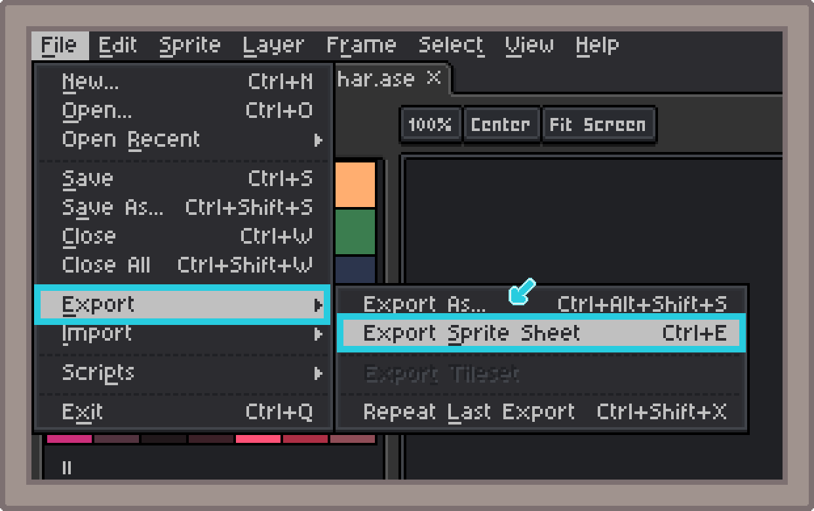
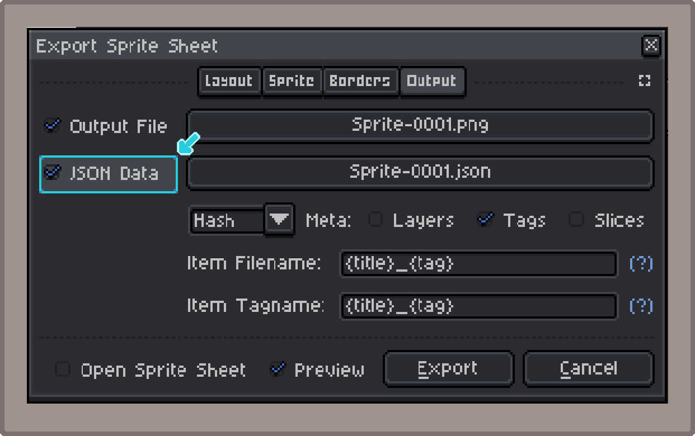
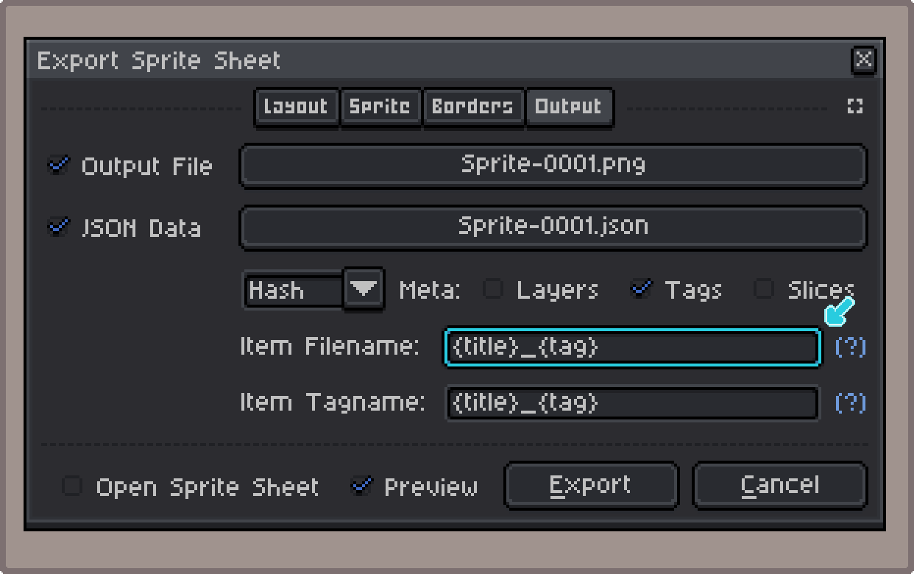
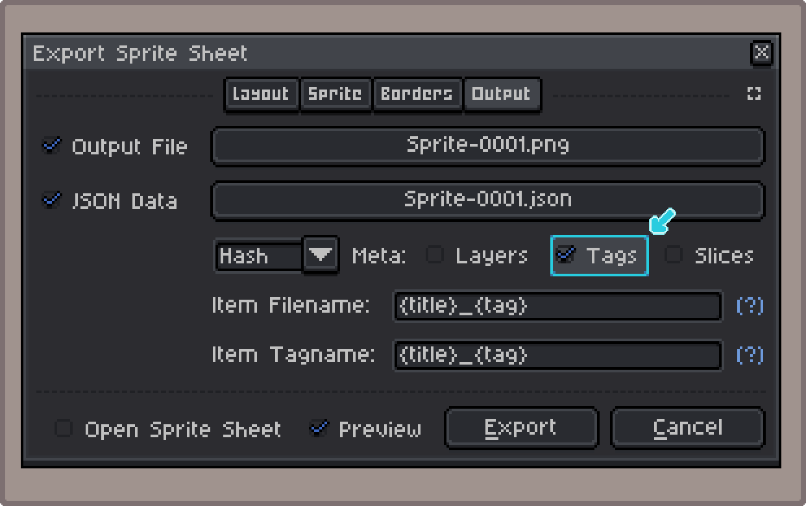

<table align="center">
  <th><a href="../index.md">       Home     </a></th>
  <th><a style="color: gray;">     Aseprite </a></th>
  <th><a href="pages/core.md">     Core     </a></th>
  <th><a href="pages/monogame.md"> MonoGame </a></th>
</table>

----------------------------------------

# Exporting a *Sprite Sheet* on *Aseprite*

This section will go in detail about how to export a *sprite sheet* on **Aseprite**, and what settings you can use to configure it to integrate it with the library.

## 1. The Export Function

To export a *sprite sheet* in **Aseprite**, you can use the shortcut `Ctrl+E`, or find it under:

> File > Export > Export Sprite Sheet

    Exporting the Sprite Sheet on <b>Aseprite</b>.

## 2. Exporting the JSON data

For **Aseprite** to include a `.json` file together with the output *sprite sheet* image, you must check the box `JSON Data`, as seen below:

    Enabling the <i>JSON Data</i>.

You can also specify a custom path to the resulting `.json` file.

## 3. Separating Animations with a `filename` Format

In the case you have multiple *animations* on the same *sprite sheet*, you can use the `Item Filename` field.

    Enabling the <i>JSON Data</i>.

For more information on the `filename` *format*, check the documentation on the [official Aseprite website](https://www.aseprite.org/docs/cli/#filename-format).

> **&#9432; QUICK INFO**  
> The *animations* will be grouped by frames with the same `Item Filename`. This means using some *special values* that indexes each frame separately, such as `{frame}`, will have the behaviour of each frame being treated as it's own *animation*. 

Here are some useful **_formats_** I use for specific scenarios:

| **Format** | **Example Outputs** | **Description** | **Use Case** |
| ---------- | ------------------- | --------------- | ------------ |
| `{title}` | *"player_char"* | Groups all frames as a single *animation*, using the actual **File** name. | If you only have a single *animation* on the sheet, an easy way to group every frame together is to use `{title}` as the *format*, which is set to the *Aseprite* **File** name (without the extension). |
| `{tag}` | *"idle"; "walk"; "jump";* | Groups frames under the same **Tag**. | When using [**Tags**](https://www.aseprite.org/docs/tags) to separate the frames of each *animation*, using `{tag}` on the *format* will automatically group the frames by **Tag** name. |
| `{tag}.{layer}` | *"body.idle", "head.idle", "body.walk", "head.walk"* | Groups frames under the same **Tag**, separated by **Layer**. | Sometimes it's needed to separate the [**Layers**](https://www.aseprite.org/docs/layers) of each *animation* *(for instance, when you need to "build" your sprite programmatically, such as a character creator)*, in those cases, you can add `{layer}` to the *format* to separate the frames by **Layer**, then, appending it to `{tag}` will also separate the *animations* by **Tag** name. Just be sure to check the box *"Split Layers"*, under the **Layout** tab. More info on the [official Aseprite documentation](https://www.aseprite.org/docs/sprite-sheet/#export). |

## 4. Using the Tag Metadata

When exporting the *sprite sheet*, you can choose to include some extra *metadata* information about the **Aseprite** *file*. Specifically, it's quite common to separate each *animation* through the use of [**Tags**](https://www.aseprite.org/docs/tags).

To toggle on **Tag** *metadata*, check the box `Meta: Tags`.

    Including <b>Tag</b> <i>metadata</i>.

If your *JSON* data file includes **Tag** *metadata*, it will be used to build the *animations*, instead of only separating the frames using the **Filename** *format*. As such, you can specify a **Tagname** to use when grouping the frames per **Tag**, but be warned that some *special values* (like `{layer}`, or `{frame}`) will be ignored.

> **&#9432; QUICK INFO**  
> As a rule of thumb, anything on the **scope** of the **Tags** or **above**, such as the **Title**, will work just fine.

By using **Tag** *metadata*, **Tag** properties like **Animation Direction** and **Repeat** will also be taken into account. Allowing greater control by the artist over the final product and less work for the developers to implement, lowering chances of misinterpretation by any party.

----------------------------------------

    By <a href="https://varollo.github.io/"><i>Varollo</i></a>.

